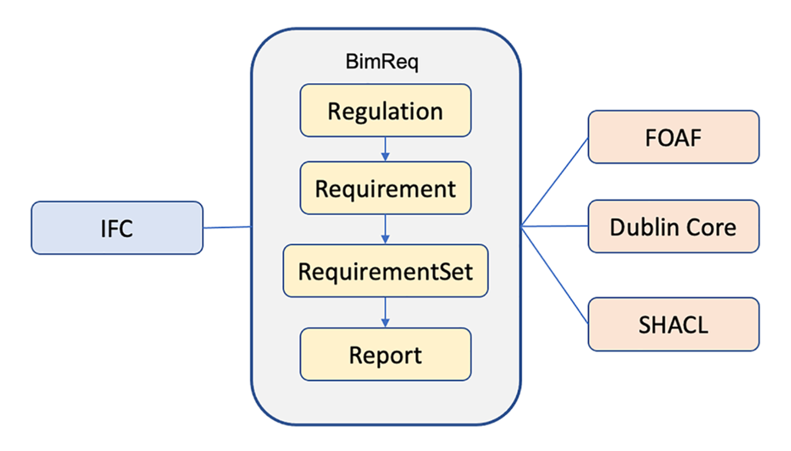

# BimReq
BimReq is a ligtweight ontology to represent regulations and requirements in RDF for construction projects. 

## Metadata
* **URI**
  * `http://demo.dsd.sztaki.hu/bimreq`
* **Creators(s)**
  * András Micsik, Ádám Kovács
* **Version Information**
  * 0.9
* **Imports**
  * [express:](https://w3id.org/express#)
  * [foaf:](http://xmlns.com/foaf/0.1/)
  * [sh:](http://www.w3.org/ns/shacl#)
* **Ontology RDF**
  * RDF ([bimreq.ttl](bimreq.ttl))
### Description
BimReq is a ligtweight ontology to represent regulations and requirements in RDF for AEC (Architecture, Engineering, Construction) projects. The requirements can refer to regulations and may contain SHACL validation shapes for compliance checking of BIM models.

Example use ([bimreqExample.ttl](bimreqExample.ttl))

Full documentation http://demo.dsd.sztaki.hu/bimreq

Overview:

